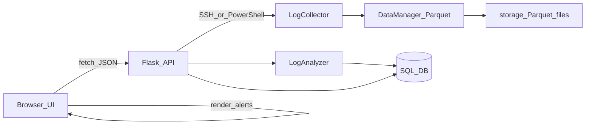

# MiniSIEM — lightweight SIEM prototype (Flask + Vanilla JS)

MiniSIEM is a small SIEM-like prototype that **collects security logs**, stores raw evidence for forensics, and **correlates events with a simple IP threat-intel registry** to generate alerts and visualize them in a dashboard.

> Provenance (subtle): this project started from a **provided blueprint/skeleton** in an academic setting. My work focused on implementing the security hardening, ETL pipeline, threat-intel correlation, and frontend integration described below.

## What it does
- **Asset management**: register monitored hosts (Windows/Linux)
- **Incremental log collection (ETL trigger)**: fetch only new logs since the last run (per host)
- **Forensic retention**: store raw logs as **Parquet** files (local evidence store)
- **Threat intel (CTI-lite)**: maintain an IP registry and use it during analysis
- **Alerting**: generate alerts with severity escalation (e.g., `BANNED` IP → `CRITICAL`)
- **UI**: dashboard view of recent alerts + admin panel for managing threat intel

## What I implemented (vs. blueprint)
The starting blueprint provided the overall structure; the items below are the concrete features/fixes I implemented (as documented in the original README that is now archived in `README_old2.md`):

- **Security hardening**
  - Password hashing using `werkzeug.security` in `app/models.py`
  - Login flow in `app/blueprints/auth.py` + a `templates/login.html` form with CSRF hidden tag
  - Defense-in-depth access control via `@login_required` for both UI (`app/blueprints/ui.py`) and API (`app/blueprints/api/hosts.py`)
- **Backend ETL orchestration**
  - End-to-end `fetch_logs(host_id)` flow in `app/blueprints/api/hosts.py`: state management (`LogSource`), incremental fetch, Parquet retention, archive metadata, analysis trigger
- **Threat intel correlation engine**
  - Analyzer logic in `app/services/log_analyzer.py`: correlate events with `IPRegistry`, auto-add unknown IPs as `UNKNOWN`, escalate `BANNED` to `CRITICAL`, persist `Alert`
- **Frontend integration**
  - API wrappers in `app/static/js/api.js` (`fetchAlerts()` + IP CRUD helpers)
  - Dashboard refresh + severity highlighting in `app/static/js/dashboard.js`
- **Stabilization fixes**
  - Fixed tuple handling from `DataManager.save_logs_to_parquet` return value
  - Improved Linux parsing patterns and log-source command coverage in `app/services/log_collector.py`
  - Fixed dashboard counter mismatch (`alerts_generated` vs `alerts`) and enabled the threat intel UI section

## High-level architecture



## Tech stack
- **Backend**: Python, Flask, SQLAlchemy, Flask-Login
- **Data**: Pandas, Parquet (local `storage/`)
- **Frontend**: Vanilla JS, Bootstrap

## Quickstart (local)
1. Install dependencies

```bash
pip install -r requirements.txt
```

2. Initialize the database

```bash
flask shell
>>> db.create_all()
```

3. Run

```bash
flask run
```

## Configuration
- Copy environment variables from `.env.example` and set the required values.
- **Note**: collecting some Windows security events may require elevated permissions (depending on host setup).

## Security notes
- **Passwords** are stored as secure hashes (no plaintext).
- **Sensitive views and API endpoints** are protected with `@login_required`.
- **CSRF**: HTML forms include CSRF protection; full CSRF protection for `fetch`-based API calls is listed under roadmap.

## Limitations / roadmap
- Cross-host correlation (same attacker IP across multiple hosts)
- Dashboard charts (e.g., attacks per hour / top attacking IPs)
- Dark mode toggle
- Full CSRF protection for API `fetch` calls

